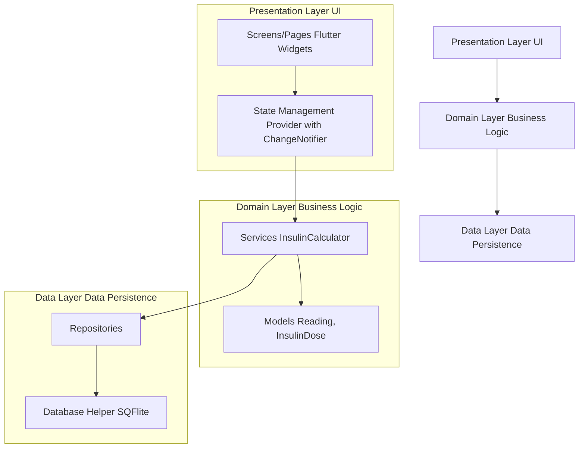
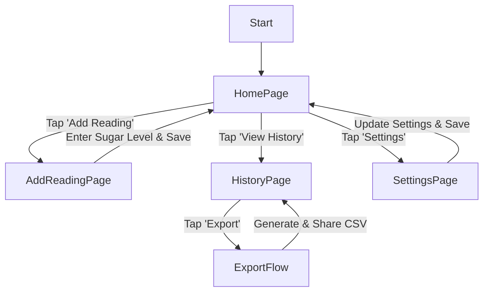

# Diabetes Tracker App: Design Document

## 1. Overview

This document outlines the design for a Flutter-based mobile application named "Diabetes Tracker". The app is designed to help diabetic patients monitor their blood sugar levels, receive insulin dosage recommendations, and maintain a history of their readings and insulin intake. The application will be built for Android, using Flutter and Dart, and will store all data locally on the device.

The core functionalities include:
-   Input for blood sugar levels at four specific times: fasting (before breakfast), pre-breakfast, pre-lunch, and pre-dinner.
-   Calculation and suggestion of two types of insulin:
    -   **Lantus:** A long-acting insulin taken before bed, with the dose calculated based on the morning's fasting sugar level and the previous day's Lantus dose.
    -   **Fiasp:** A fast-acting insulin taken before each meal, with the dose calculated based on the current blood sugar level and a configurable base unit for that meal.
-   A historical view of sugar levels and insulin doses, exportable in a tabular format (CSV) for weekly or monthly periods.

The application will be designed with a focus on simplicity, reliability, and data privacy, ensuring that sensitive health information is stored securely on the user's device.

## 2. Detailed Analysis of the Goal

The primary goal of this application is to empower diabetes patients to manage their condition more effectively by automating the complex and often error-prone task of calculating insulin dosages.

### Key User Stories:

-   **As a patient, I want to:**
    -   Quickly and easily enter my blood sugar reading so that I can get an immediate insulin recommendation.
    -   See a clear suggestion for my Fiasp insulin dose before each meal (breakfast, lunch, dinner).
    -   See a clear suggestion for my Lantus insulin dose before bed.
    -   Configure my base Fiasp units for each meal, as they may be adjusted by my doctor.
    -   Input my previous day's Lantus dose if it's my first time using the app or if I need to correct the value.
    -   View a history of my past sugar readings and insulin doses to track my progress.
    -   Export my weekly or monthly history into a simple, shareable format (like a table in a CSV file) to show my doctor.

### Functional Requirements:

1.  **Data Input:**
    -   The app must provide a simple interface to input a numerical blood sugar level.
    -   The input mechanism should be tied to a specific time of day: Fasting, Breakfast, Lunch, or Dinner.
    -   The app must allow the user to input their previous day's Lantus units.
    -   The app must allow the user to configure the base Fiasp units for each meal.

2.  **Insulin Calculation Logic:**
    -   **Lantus:**
        -   Requires: Fasting blood sugar level, previous day's Lantus units (defaulting to 20 if not available).
        -   Rules:
            -   If sugar < 80: Previous units - 4
            -   If sugar >= 130: Previous units + 2
            -   If sugar >= 180: Previous units + 4
            -   Else: Previous units
    -   **Fiasp:**
        -   Requires: Current blood sugar level, meal type (Breakfast, Lunch, Dinner), and corresponding base units (defaulting to 8, 8, 6 respectively).
        -   Rules:
            -   If sugar < 80: Base value - 2
            -   If sugar >= 140: Base value + 1
            -   If sugar >= 180: Base value + 2
            -   If sugar >= 220: Base value + 3
            -   If sugar >= 260: Base value + 4
            -   Else: Base value

3.  **Data Storage:**
    -   All sugar readings and calculated insulin doses must be stored locally with a timestamp.
    -   User-configurable settings (base Fiasp units) must be persisted.
    -   The application will use a local SQLite database for structured, queryable data storage.

4.  **Data Presentation & Export:**
    -   The app will display a historical log of entries.
    -   The app must provide an option to export this history for a selected time range (weekly/monthly) into a CSV file.

### Non-Functional Requirements:

-   **Platform:** Android (initially, but Flutter allows for future iOS support).
-   **Security:** As the app handles sensitive health data (PHI), all data must be stored securely. While it's local, we will follow best practices to protect it.
-   **Performance:** The app should be fast and responsive, especially during data entry and calculation.
-   **Usability:** The UI must be clean, intuitive, and easy to use, particularly for users who may not be tech-savvy.

## 3. Alternatives Considered

### Data Storage:

-   **`shared_preferences`:** Good for simple key-value data like user settings (e.g., base Fiasp units). However, it is not suitable for storing and querying structured, time-series data like sugar level history.
-   **`hive`:** A fast NoSQL database. It's a strong alternative to SQLite and is often simpler to set up. However, for relational data and complex queries (e.g., "get all readings for the last 7 days"), SQLite's SQL interface is more powerful and standardized.
-   **`sqflite` (Chosen):** A Flutter plugin for SQLite. This is the best choice for this application because it provides a robust, well-supported, and queryable relational database. This makes it ideal for managing the history of sugar levels and insulin doses and for generating reports.

### State Management:

-   **`StatefulWidget` with `setState()`:** Suitable for simple, local UI state changes. We will use this for managing transient state within individual screens, such as form inputs.
-   **`provider` with `ChangeNotifier` (Chosen):** For managing application-wide state and business logic, this approach provides a good balance of simplicity and power. We can create `ChangeNotifier`s to manage the state of the sugar readings, insulin calculations, and historical data. This allows us to separate business logic from the UI and efficiently update the UI when data changes.
-   **BLoC (Business Logic Component):** A more structured and powerful pattern, but it can introduce more boilerplate. For an app of this scale, `provider` is sufficient and easier to implement.

### Data Export:

-   **PDF:** Exporting to PDF provides a visually appealing, non-editable format. The `pdf` and `printing` packages are excellent for this.
-   **CSV (Chosen):** Exporting to CSV is simpler to implement and provides data in a universally accessible, tabular format that can be easily opened in spreadsheet software like Excel or Google Sheets. This aligns perfectly with the user's requirement for a "table format". The `csv` package is the standard for this.

## 4. Detailed Design

### Architecture

We will adopt a layered architecture to ensure a clean separation of concerns, making the app scalable and maintainable.



-   **Presentation Layer:** Contains all UI-related components (Widgets). It will use `provider` to interact with the domain layer and react to state changes.
    -   **`HomePage`:** The main screen, showing current status and providing navigation to other sections.
    -   **`AddReadingPage`:** A form to input new sugar levels.
    -   **`HistoryPage`:** Displays a list of all historical readings and provides the export functionality.
    -   **`SettingsPage`:** Allows the user to configure base Fiasp units and the default previous day's Lantus dose.
-   **Domain Layer:** Contains the core business logic and data models. It is independent of the UI and the database implementation.
    -   **Models:**
        -   `Reading`: Represents a single blood sugar reading event (value, type, timestamp).
        -   `InsulinDose`: Represents a calculated insulin dose (units, type, timestamp).
        -   `UserSettings`: Holds the configurable base values.
    -   **Services:**
        -   `InsulinCalculatorService`: A pure Dart class responsible for all insulin calculation logic.
-   **Data Layer:** Responsible for all data persistence and retrieval.
    -   **`DatabaseHelper`:** A singleton class that manages the SQLite database connection, table creation, and CRUD operations using the `sqflite` package.
    -   **`ReadingRepository`:** Provides an abstraction over the database for all operations related to `Reading` objects (e.g., `addReading`, `getReadingsInDateRange`).

### Data Models

**`reading.dart`**
```dart
enum ReadingType { Fasting, Breakfast, Lunch, Dinner }

class Reading {
  final int? id;
  final int sugarLevel;
  final ReadingType type;
  final DateTime timestamp;

  // Constructor
}
```

**`insulin_dose.dart`**
```dart
enum InsulinType { Lantus, Fiasp }

class InsulinDose {
  final int? id;
  final int units;
  final InsulinType type;
  final DateTime timestamp;

  // Constructor
}
```

**`user_settings.dart`**
```dart
class UserSettings {
  final int fiaspBreakfastBase;
  final int fiaspLunchBase;
  final int fiaspDinnerBase;
  final int defaultPreviousLantus;

  // Constructor
}
```

### Database Schema

We will have two main tables in our SQLite database:

**`readings` table:**
-   `id` (INTEGER, PRIMARY KEY, AUTOINCREMENT)
-   `sugar_level` (INTEGER, NOT NULL)
-   `type` (TEXT, NOT NULL) - Storing the enum `ReadingType` as a string.
-   `timestamp` (TEXT, NOT NULL) - Storing `DateTime` as an ISO 8601 string.

**`insulin_doses` table:**
-   `id` (INTEGER, PRIMARY KEY, AUTOINCREMENT)
-   `units` (INTEGER, NOT NULL)
-   `type` (TEXT, NOT NULL) - Storing the enum `InsulinType` as a string.
-   `timestamp` (TEXT, NOT NULL)

User settings will be stored using `shared_preferences` for simplicity, as they are simple key-value pairs.

### UI Flow



## 5. Summary of Design

The Diabetes Tracker app will be a Flutter-based Android application designed for local-first operation. It will use a clean, layered architecture separating UI, business logic, and data persistence. Data will be stored in a local SQLite database managed by the `sqflite` package, ensuring efficient querying for historical reports. State management will be handled by the `provider` package, and data export will be implemented using the `csv` package. The design prioritizes ease of use, data privacy, and reliable calculation logic as specified by the user.

## 6. References

-   **Flutter App Architecture:** [https://flutter.dev/docs/development/data-and-backend/state-mgmt/options](https://flutter.dev/docs/development/data-and-backend/state-mgmt/options)
-   **SQFlite Package:** [https://pub.dev/packages/sqflite](https://pub.dev/packages/sqflite)
-   **Provider Package:** [https://pub.dev/packages/provider](https://pub.dev/packages/provider)
-   **CSV Package:** [https://pub.dev/packages/csv](https://pub.dev/packages/csv)
-   **Health App Best Practices:** [https://mindbowser.com/hipaa-compliant-app-development](https://mindbowser.com/hipaa-compliant-app-development)

This design provides a solid foundation for building a robust and user-friendly application that meets all the specified requirements.
